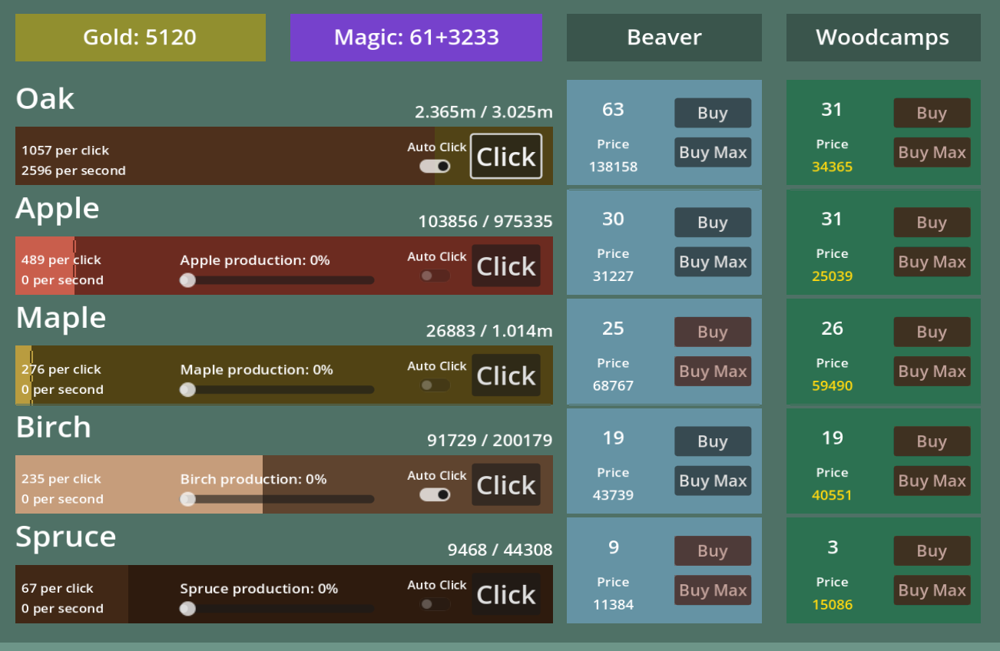
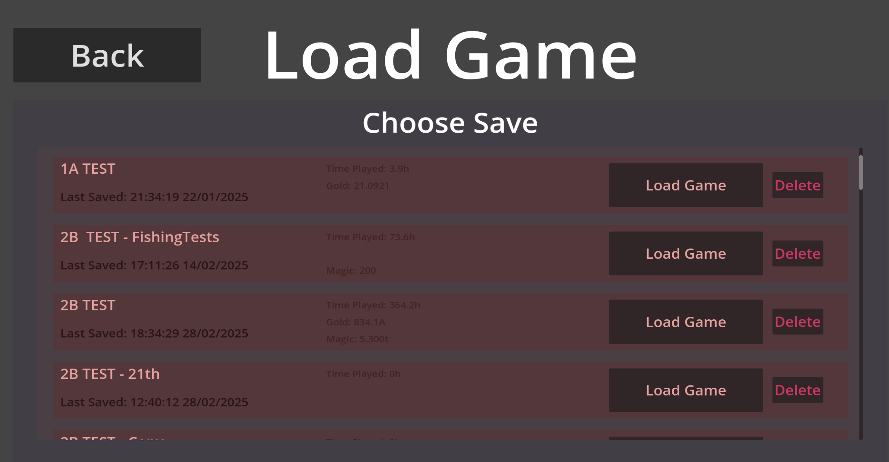

# Beaver Incremental
## [Download at Itch.io](https://catgizmo.itch.io/beaver-incremental)
*Be the best beaver out there and create the greatest dam ever built!*

This is an incremental clicker type game where you are a beaver (imagine it) and you collect wood, buy upgrades, discover magic, fish and do some more fun stuff!

This game has a save system so come back anytime you please!

## Details

- Play Time: 100 - 200 h
- Engine: Godot 4.3 using GDscript
- Author: Mārtiņš Dāvis Bernhards

## Notes

This is the first incremental genre game I have created, it took a lot of planning, trial and error and at some points made my head hurt. It is not a perfect game, far from it, but it is something I created and it is something you can play! So if you like seeing numbers go up this might be a game you want to try out.

PS. There is no beaver art in the game